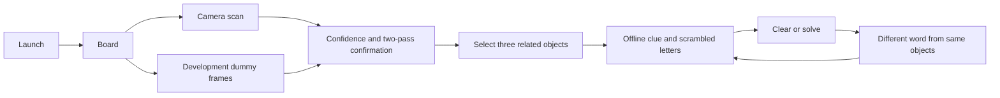

# Runtime flow

Last updated: 2026-10-13

```mermaid
flowchart LR
    Launch --> Board
    Board --> Scan[Camera scan]
    Board --> Dummy[Development dummy frames]
    Scan --> Confirm[Confidence and two-pass confirmation]
    Dummy --> Confirm
    Confirm --> Select[Select three related objects]
    Select --> Puzzle[Offline clue and scrambled letters]
    Puzzle --> Solve[Clear or solve]
    Solve --> Next[Different word from same objects]
    Next --> Puzzle
```
